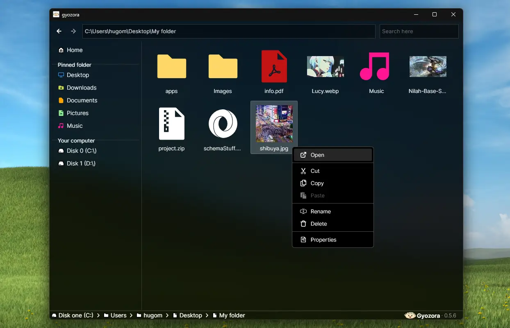

<p align="center">
  
</p>

<h1 align="center">Gyozora</h1>

<p align="center">
  <a href="./LICENSE.md"></a>
  
  
</p>

<h2>About gyozora</h2>
Gyozora is a fast and lightweight file explorer in early development. It currently supports Windows & macOS and will be fully compatible with Linux in future versions. <br /><br />

***Note: Gyozora it's still in development. Some key features might not work as expected.***

<h2>Key features</h2>

- Lightweight.
- Fast folder navigation.
- Modern UI.
- Highly customizable.
- All the features you would expect in a standard file explorer.
- User-friendly.
- Enhanced performance.

<br />

### 📷 Screenshot



### ⬇️ Install it
You can install the latest release <a href="https://github.com/keelus/gyozora/releases/latest">here</a>.

### 🛠️ Develop it
To serve a development live build of gyozora, <a href="https://wails.io/">wails</a> and <a href="https://www.npmjs.com/">npm</a> must be installed on your system.
1. Clone the repository
```bash
git clone https://github.com/keelus/gyozora.git
cd gyozora
```
2. Install dependencies (you can skip to the next step, which also installs the dependencies)
```bash
npm install ./frontend
```
3. Build a live dev version
```bash
wails dev
```
### 🛠️ Build it
Build gyozora yourself.

***Note: Due to Wails limitations, cross-compiling is not supported.***
```bash
# for Windows
wails build -nsis

# for macOS & Linux
wails build
```
The generated binaries will appear in `./build`

### 🥟📂 Important incoming features:

#### 💻 OS compatibility:
- [x] ~~🪟 Windows (10 & 11)~~
- [x] ~~🍎 macOS (arm64[m1, m2] & amd64[intel])~~
- [ ] 🐧 Linux (amd64, arm64 & arm)

#### 📄 Context menu/file related:
- [x] ~~➕ Add/create a file~~
- [x] ~~📋 Copy file(s)~~
- [ ] 📋 Cut file(s)
- [x] ~~📋 Paste file(s)~~
- [x] ~~🆔 Rename a file~~
- [x] ~~🗑️ Delete file(s)~~
- [x] ~~ℹ️ Properties of a file~~

#### 🧑‍💻 User configuration related:
- [x] ~~🎨 Choose a color theme~~
- [ ] 📊 Multiple UX options:
  - [ ] Enable/disable file deletion confirmation modal
  - [ ] Change language
  - [ ] ... More

#### 🥟 Others:
- [ ] 🌍 Internationalization
  - [x] ~~🇺🇸 English~~
  - [ ] 🇪🇸 Spanish
- [x] ~~ℹ️ Error messages/toasts~~

<br />
Made by <a href="https://github.com/keelus">keelus</a> ✌️